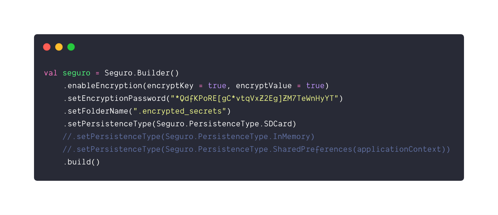

# seguro 

> Secure persistence (<strong>Memory/SharedPreferences/SDCard</strong>) using <strong>AES+CBC encryption</strong> on Android with no dependencies. 

<p align="center">
  
</p>

<p align="center">
  <a href="https://github.com/cesarferreira/seguro/blob/master/LICENSE"></a>
  
  <a href="https://travis-ci.org/cesarferreira/seguro"></a>
</p>


## Usage

```kotlin
seguro = Seguro.Builder()
    .enableEncryption(encryptKey = true, encryptValue = true)
    .setEncryptionPassword("*QdfKPoRE[gC*vtqVxZ2Eg]ZM7TeWnHyYT")
    .setFolderName(".${BuildConfig.APPLICATION_ID}")
    .setPersistenceType(Seguro.PersistenceType.SDCard)
	//.setPersistentType(Seguro.PersistenceType.InMemory)
	//.setPersistentType(Seguro.PersistenceType.SharedPreferences(applicationContext))
    .build()
```

### Persistence types:

> `Seguro.PersistenceType.SDCard`

Persists the values to your SDCARD in the folder you specified in the `folderName`

> `Seguro.PersistenceType.InMemory`

Persists the values to the `memory`

> `Seguro.PersistenceType.SharedPreferences`

Persists the values to your `SharedPreferences`

## Writing:

```kotlin
seguro.Editor()
    .put("KEY_TIME", Date().time)
    .put("KEY_NAME", "Cesar Ferreira")
    .put("KEY_AGE", 31)
    .commit()
```

Because we chose to encrypt the `key` and the `value`, this will result in:

```
key: A0A7BDDA0D99CB02AC4DA421567535225F5F6013C5C699085D44A52404C97A83, value: D0EA346FE0A8D0C659848B10AADB2B057FE5E5AF3E15C13E195F4E89DA57E6BB
key: 9E9EA39C1F609E42E587458395C1C752DE8F06D2120483F1B08E883B53B8E739, value: 81A2B85774957B916A7067E31A662F699BCA9E87D01394D17F01AE506634BC78
key: 39E365FFA2B81165CB5CFE49098E2AFB520F3B129F092022D0FD3F09B3C5B0B1, value: 7BDC46776B8414C5A5B00FFFF45031E9C9FB8803DC8BF246CC311310EB8191ED

```

## Reading:

```kotlin
val name = seguro.getString("KEY_NAME") // "Cesar Ferreira"
val age = seguro.getInt("KEY_AGE")      // 31
```

## Install

```groovy
TODO
```


---------------------

Made with ♥ by [Cesar Ferreira](http://cesarferreira.com)

